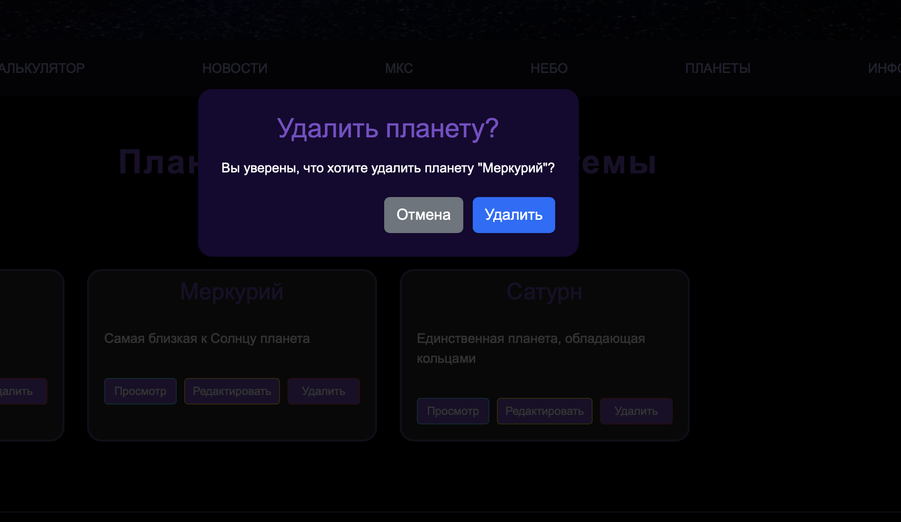

# 3 - Простое веб-приложение. Верстка <!-- omit in toc -->

> Лабораторная работа 3 для студентов курса "Проектирование сетевых приложений" 4 семестра кафедры ИУ5 МГТУ им Н.Э. Баумана.

## Содержание <!-- omit in toc -->

- [Цель работы](#цель-работы)
- [Начало работы](#начало-работы)
- [Задание](#задание)
- [Указания по выполнению лабораторной работы](#указания-по-выполнению-лабораторной-работы)
    - [Структура проекта](#структура-проекта)
	- [Требования к реализации](#требования-к-реализации)
- [Пример программы](#пример-программы)
- [Результат работы](#результат-работы)

## Цель работы

Знакомство с node, npm, написание простого приложения на JavaScript. В ходе выполнения работы, вам предстоит ознакомиться с кодом реализации простого интерфейса и вывода данных, и затем выполнить задания по варианту

---

## Начало работы

Зайдите в свою локальную директорию с репозиторием для выполнения лабораторных работ. Заберите ветку с соответствующей лабораторной работой из общего репозитория:

```sh
git pull upstream
```

**или**

```sh
git pull upstream lab_3
```

Переключитесь на ветку с текущей лабораторной работой:

```sh
git checkout lab_3
```

Свяжите ветку локального репозитория с вашим удаленным репозиторием:

```sh
git push --set-upstream lab_3
```

## Задание

1. Создать двухстраничное приложение из примера по вариантам
2. Вариант состоит из темы и компонента, который необходимо использовать
3. Все данные должны соответствовать выбранной теме
4. Компонент можно применить по своему усмотрению

---
## Указания по выполнению лабораторной работы

1. Инициализировать проект через npm init и установить Bootstrap
2. Создать классы MainPage и ProductPage с перерисовкой контейнера #root
3. Вынести компоненты (карточка, кнопка назад) в папку components/
4. Данные для карточек хранить в массиве в методе getData()
5. Реализовать лайтбокс с навигацией по стрелкам клавиатуры

---

### Структура проекта


---

### Требования к реализации

1. Код должен быть написан на JavaScript (ES6+) с использованием модулей (import / export)
2. Проект должен быть инициализирован через npm init
3. Установлен и подключен Bootstrap через npm
4. Страницы должны быть реализованы в виде классов (MainPage, ProductPage)
5. Компоненты должны быть переиспользуемыми и храниться в папке components/
6. Данные для карточек должны быть вынесены в отдельный массив в методе getData()
7. При переходе между страницами должен перерисовываться только контейнер #root
8. Поддержка открытия страницы продукта по ID карточки

---

## Пример программы

Переход на страницу планеты и рендер главной страницы

```javascript
export class MainPage {
    clickCard(cardId) {
        const planetPage = new PlanetPage(this.parent, cardId);
        planetPage.render();
    }

    render() {
        this.parent.innerHTML = '';
        const html = this.getHTML();
        this.parent.insertAdjacentHTML('beforeend', html);

        const container = document.getElementById('planets-container');
        const data = this.getData();

        data.forEach((item) => {
            const planetCard = new PlanetCardComponent(container);
            planetCard.render(item, this.clickCard.bind(this));
        });
    }
}
```
Обработка клика по заголовку карточки и открытие лайтбокса при клике на изображение

```javascript
export class PlanetCardComponent {
    addListeners(data, clickHandler) {
        const titleElement = document.querySelector(`.planet-title[data-id="${data.id}"]`);
        if (titleElement) {
            titleElement.addEventListener("click", (e) => {
                e.stopPropagation();
                clickHandler(data.id);
            });
        }

        const imgElement = document.querySelector(`.planet-img[data-id="${data.id}"]`);
        const container = imgElement?.closest('.image-container');
        
        if (container) {
            container.addEventListener('click', (e) => {
                if (!e.target.closest('.planet-title')) {
                    this.openLightbox(data.id);
                }
            });
        }
    }
}
```
Лайтбокс с навигацией по стрелкам клавиатуры

```javascript
export class PlanetCardComponent {
    openLightbox(planetId) {
        const planets = this.getAllPlanets();
        let currentIndex = planets.findIndex(p => p.id === planetId);
        
        const keyHandler = (e) => {
            if (!document.getElementById('lightbox')) {
                document.removeEventListener('keydown', keyHandler);
                return;
            }
            if (e.key === 'ArrowLeft') {
                currentIndex = (currentIndex - 1 + planets.length) % planets.length;
                updateImage();
            } else if (e.key === 'ArrowRight') {
                currentIndex = (currentIndex + 1) % planets.length;
                updateImage();
            } else if (e.key === 'Escape') {
                lightbox.remove();
            }
        };
        
        document.addEventListener('keydown', keyHandler);
    }
}
```
Страница планеты с кнопкой назад и детальной информацией

```javascript
export class PlanetPage {
    clickBack() {
        const mainPage = new MainPage(this.parent);
        mainPage.render();
    }

    render() {
        this.parent.innerHTML = '';
        const html = this.getHTML();
        this.parent.insertAdjacentHTML('beforeend', html);

        const backButton = new BackButtonComponent(this.pageRoot);
        backButton.render(this.clickBack.bind(this));

        const container = document.getElementById('planet-detail-container');
        const data = this.getData();
        const planetDetail = new PlanetDetailComponent(container);
        planetDetail.render(data);
    }
}
```

---

## Результат работы




---