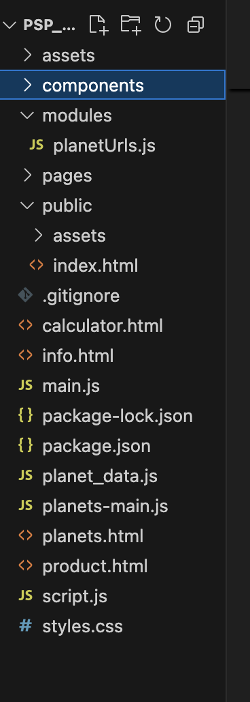
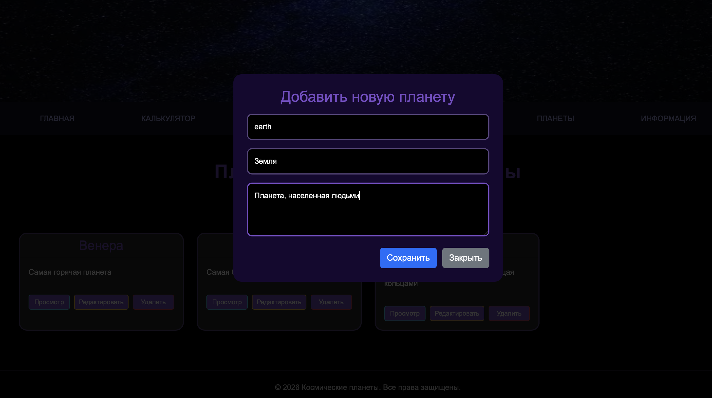
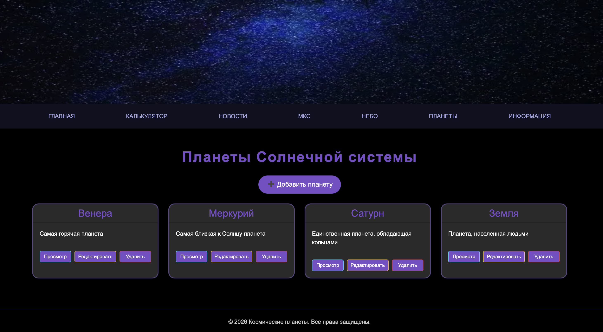

# 6 - Знакомство с promise и fetch, сборка клиентской части <!-- omit in toc -->

> Лабораторная работа 6 для студентов курса "Проектирование сетевых приложений" 4 семестра кафедры ИУ5 МГТУ им Н.Э. Баумана.

## Содержание <!-- omit in toc -->

- [Цель работы](#цель-работы)
- [Начало работы](#начало-работы)
- [Задание](#задание)
- [Указания по выполнению лабораторной работы](#указания-по-выполнению-лабораторной-работы)
    - [Структура проекта](#структура-проекта)
	- [Требования к реализации](#требования-к-реализации)
- [Пример программы](#пример-программы)
- [Результат работы](#результат-работы)

## Цель работы

Первая часть данной лабораторной работы заключается в изменении механизма взаимодействия с внешним API: в прошлой лабораторной работе использовался XMLHttpRequest, в этой - современный метод fetch. В ходе выполнения работы предстоит познакомиться с кратким полезным теоретическим материалом, кодом реализации простого взаимодействия с внешним API, получением данных и выводом их в интерфейс пользователя, и выполнить задания по варианту.
Вторая часть лабораторной работы заключается в сборке клиентской части приложения: необходимо "сбилдить" клиентскую часть (ЛР №3) с помощью системы сборки, а также добавить в серверную часть (ЛР №4) возможность раздачи клиентской части в качестве статики во избежание проблем с CORS.

---

## Начало работы

Зайдите в свою локальную директорию с репозиторием для выполнения лабораторных работ. Заберите ветку с соответствующей лабораторной работой из общего репозитория:

```sh
git pull upstream
```

**или**

```sh
git pull upstream lab_6
```

Переключитесь на ветку с текущей лабораторной работой:

```sh
git checkout lab_6
```

Свяжите ветку локального репозитория с вашим удаленным репозиторием:

```sh
git push --set-upstream origin lab_6
```

## Задание

1. Заменить все вызовы и использования XMLHttpRequest на fetch во фронтенд-части приложения
2. Реализовать асинхронные запросы с использованием async/await
3. Собрать клиентскую часть приложения с помощью Vite
4. Настроить серверную часть (ЛР №4) для раздачи статики из папки public
5. Убедиться, что CORS-ошибки отсутствуют, так как запросы выполняются с того же домена

---
## Указания по выполнению лабораторной работы

1. Удалить устаревший модуль с XMLHttpRequest
2. Убрать импорт этого модуля из главного файла
3. Все запросы к API переписать на fetch с async/await
4. Добавить функции для создания и обновления данных, привязав их к кнопкам сохранения в формах

---

### Структура проекта



---

### Требования к реализации

1. Все запросы к API должны быть переписаны на fetch с использованием async/await
2. Удалены файлы modules/ajax.js и modules/stockUrls.js
3. Клиентская часть собрана с помощью Vite в папку public
4. Серверная часть раздаёт статику из папки public
5. Отсутствуют CORS-ошибки при открытии сайта через http://localhost:3000

---

## Пример программы
Основные fetch-запросы

```javascript
// GET - получить все планеты
async function getAllPlanets() {
    const response = await fetch('http://localhost:3000/planets');
    if (response.ok) {
        return await response.json();
    }
    throw new Error(`HTTP error! status: ${response.status}`);
}

// POST - добавить планету
async function addPlanet(planetData) {
    const response = await fetch('http://localhost:3000/planets', {
        method: 'POST',
        headers: { 'Content-Type': 'application/json' },
        body: JSON.stringify(planetData)
    });
    return await response.json();
}

// PATCH - обновить планету
async function updatePlanet(planetId, planetData) {
    const response = await fetch(`http://localhost:3000/planets/${planetId}`, {
        method: 'PATCH',
        headers: { 'Content-Type': 'application/json' },
        body: JSON.stringify(planetData)
    });
    return await response.json();
}

// DELETE - удалить планету
async function deletePlanet(planetId) {
    const response = await fetch(`http://localhost:3000/planets/${planetId}`, {
        method: 'DELETE'
    });
    return response.status === 204 || response.status === 200;
}
```
---

## Результат работы




---